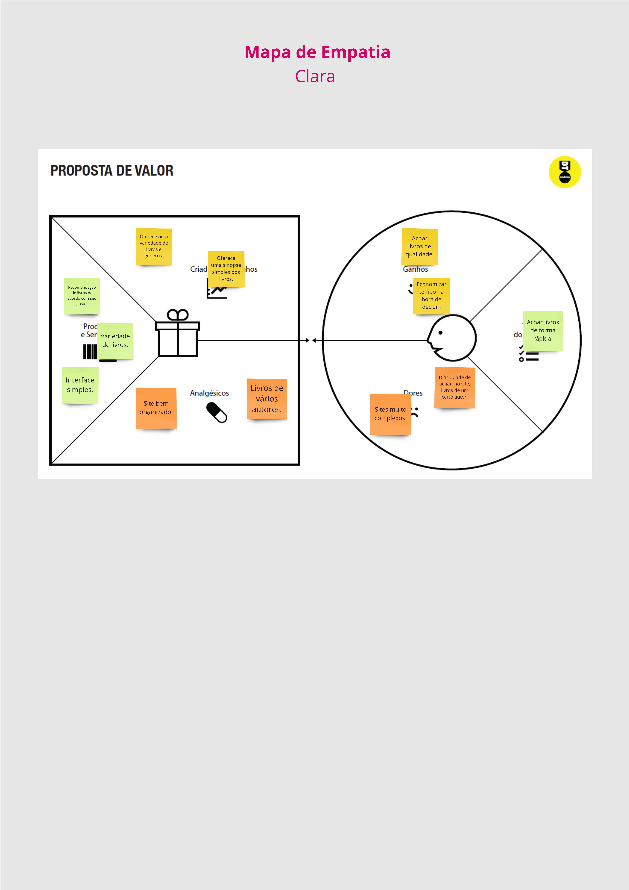
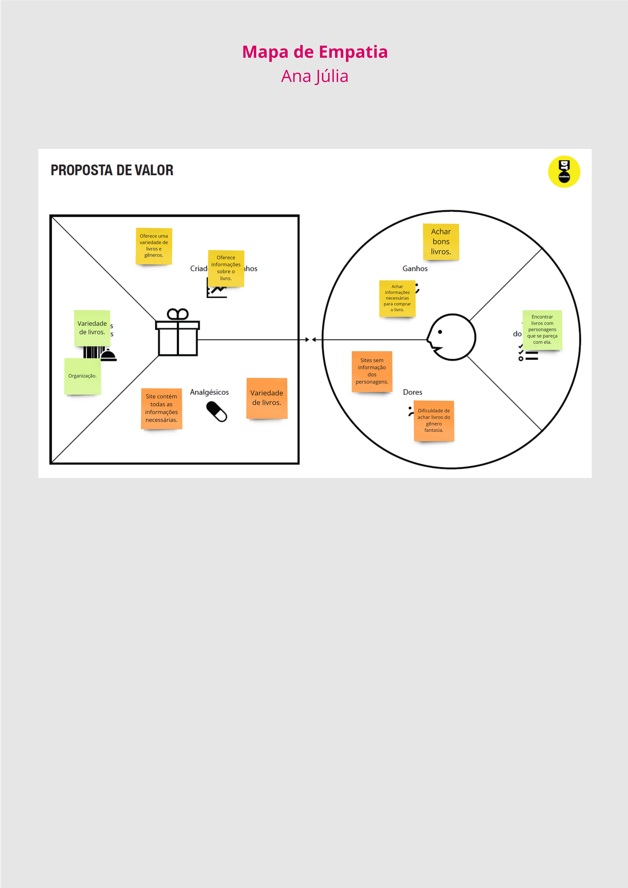

# Product discovery

Pré-requisitos: <a href="01-Contexto.md"> Documentação de contexto</a>

✅ [Documentação de Design Thinking (MIRO)](files/processo-dt.pdf)

---

## Etapa de Entendimento

### Matriz CSD e Mapa de Stakeholders

 
 
 

### Entrevistas Qualitativas

 
 
 

 
 
 

 
 
 

 
 
 

 
 
 

 
 
 
## Highlights de pesquisa: 

---

## Etapa de definição

### Personas e Mapas de Empatia

 
 
 
 

 
 
 
 

 
 
 
 
 

 
 
 
 

 
 
 
 

