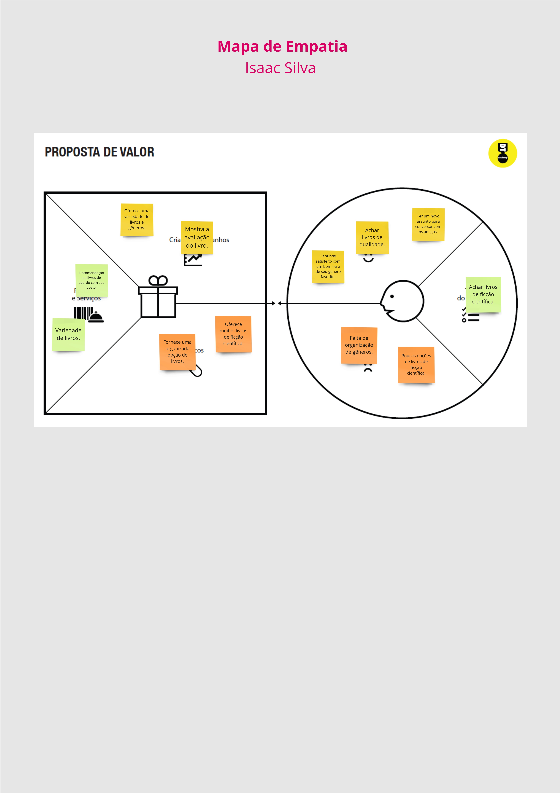
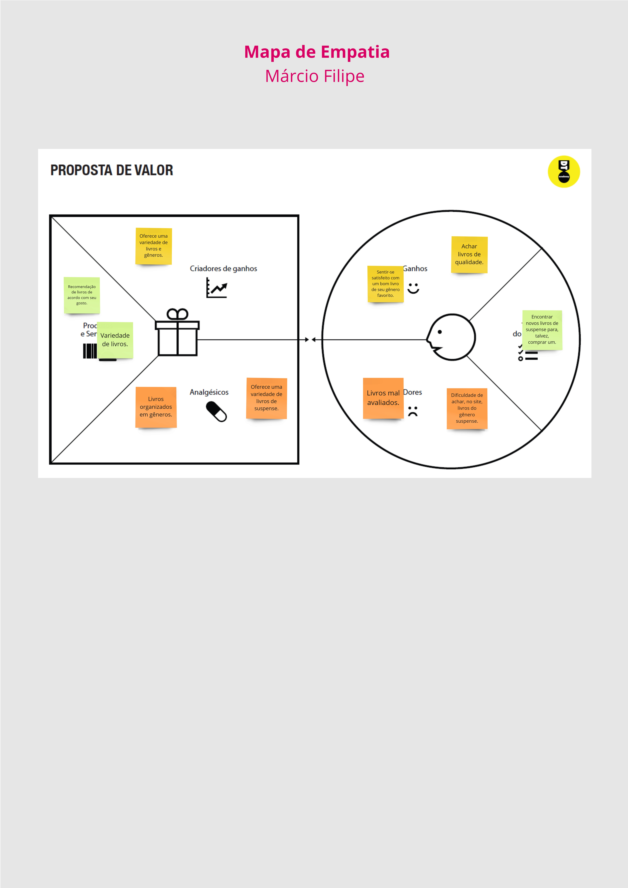
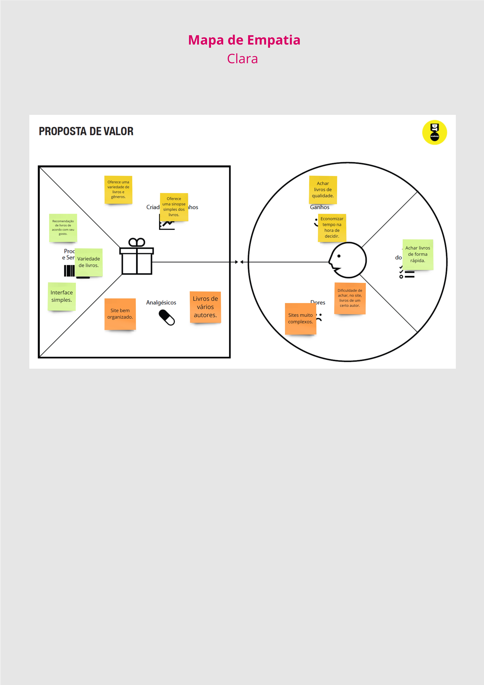
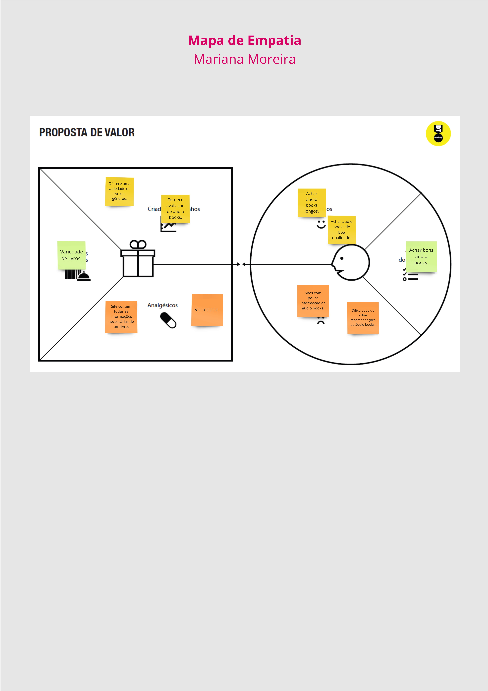
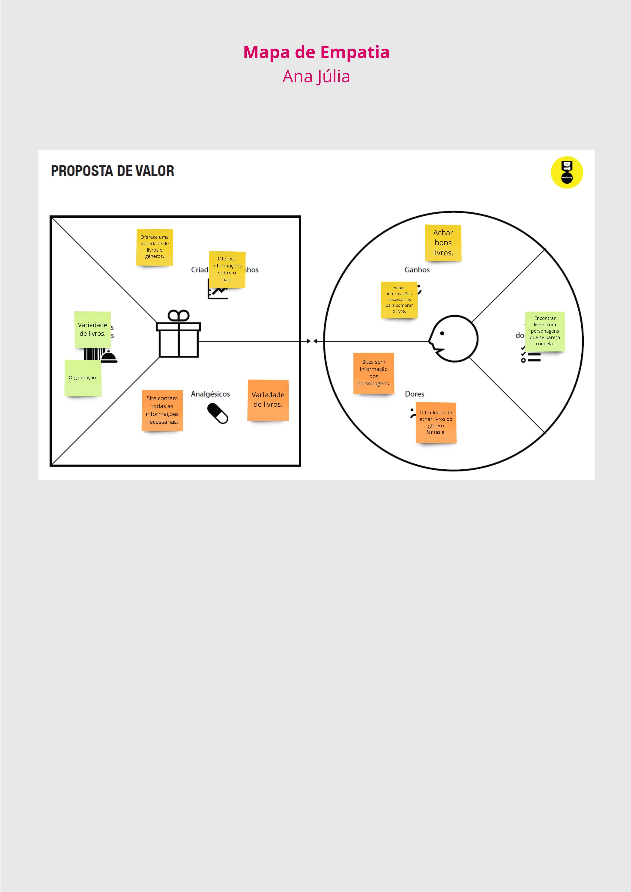
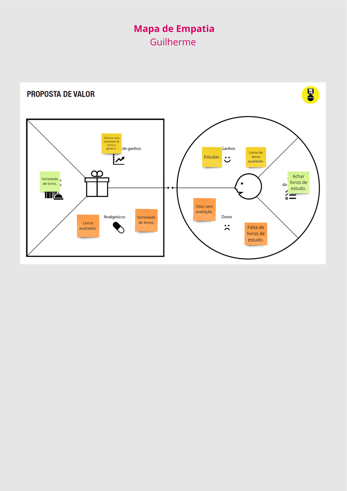

# Product design

Pré-requisitos: <a href="02-Product-discovery.md"> Product discovery</a>

## Histórias de usuários

Com base na análise das personas, foram identificadas as seguintes histórias de usuários:

|EU COMO... `PERSONA`| QUERO/PRECISO ... `FUNCIONALIDADE` |PARA ... `MOTIVO/VALOR`                 |
|--------------------|------------------------------------|----------------------------------------|
|Amo personagens que se parecem comigo  |Descrição dos personagens         | Me identificar com eles |
|Gosto de livros de suspense |Livros semelhantes| Comprar um livro |
|Estou englobado no mundo da tecnologia | Achar um livro de ficção científica | Ler e comentar com meus amigos |
| Não tenho muito tempo livre | Um site que me indique boas leituras de forma rápida e objetiva | Decidir se vou comprar ou não |
| Pretendo viajar muito ano que vem | Encontrar bons audiobooks | Escutar enquanto estou viajando |
| Pretendo entrar na faculdade ano que vem | Um site que me indique os melhores livros de estudo | Estudar para o Enem |

## Proposta de valor

 
 

 
 

 
 

 
 

 
 

 
 
 
 

## Requisitos

As tabelas a seguir apresentam os requisitos funcionais e não funcionais que detalham o escopo do projeto. Para determinar a prioridade dos requisitos, aplique uma técnica de priorização e detalhe como essa técnica foi aplicada.

### Requisitos funcionais
| ID     | Descrição do Requisito                                   | Prioridade |
| ------ | ---------------------------------------------------------- | ---------- |
| RF-001 | Cadastro de usuários: Permite com que o usuário se cadastre para entrar no site. | ALTA |
| RF-002 | Vistos Recentemente: Listar os últimos livros acessados pelo usuário na sessão atual. Exibir informações básicas do livro: título, autor e сара. Redirecionar para a página do livro ao clicar no item. Atualizar em tempo real à medida que o usuário acessa novos livros. | MÉDIA      |
| RF-003 | Favoritos: Permite o usuário salvar o livro em uma lista de favoritos, bem como remover. | ALTA     |
| RF-004 | Aba de Comentários: O sistema deve permitir com que o usuário escreva e envie um comentário. O sistema deve emitir um alerta para o usuário, após o envio do comentário, sinalizando que este foi enviado com sucesso. | ALTA |
| RF-005 | Best-Sellers: O sistema deve retornar os best-sellers do ano vigente de acordo com a Open Library API (https://openlibrary.org/subjects/bestsellers). O sistema deve retornar os livros em cards, que devem possuir o título do livro e o autor deste. O sistema deve possuir um título para esta feature, sendo capaz identificar o nome do projeto Caiu na Rede, é Livro, além do ano que está sendo referenciado. | ALTA |
| RF-006 | API para filtragem e exibição de livros: Permite com que o usuário filtre os livros disponibilizados na api: https://openlibrary.org , com os critérios: pesquisa por nome, autor, gênero, e número mínimo de páginas. | ALTA |

### Requisitos não funcionais
| ID      | Descrição do Requisito                                                              | Prioridade |
| ------- | ------------------------------------------------------------------------------------- | ---------- |
| RNF-001 | Banner: Possuir link para redirecionar para página de saiba mais. Alterar dinamicamente os conteúdos. Ser responsivo e ajustar-se a diferentes tamanhos de tela. | BAIXA     |
| RNF-002 | Carrossel: Permite com que o usuário clique em uma das imagens e seja direcionado para página: livros em alta e últimos lançamentos. Alterar dinamicamente os conteúdos.        | BAIXA      |
| RNF-003 | Avaliação com estrela: Permitir com que o usuário avalie o livro de 1 a 5 estrelas. | MÉDIA |

## Restrições

O projeto está restrito aos itens apresentados na tabela a seguir.
|ID| Restrição                                             |
|--|-------------------------------------------------------|
|001| O site deve ser responsivo. |
|002| Os elementos do site devem ser funcionais e organizados.  |
|003| O trabalho deve ser entregue até dia 08/12/2024. |
