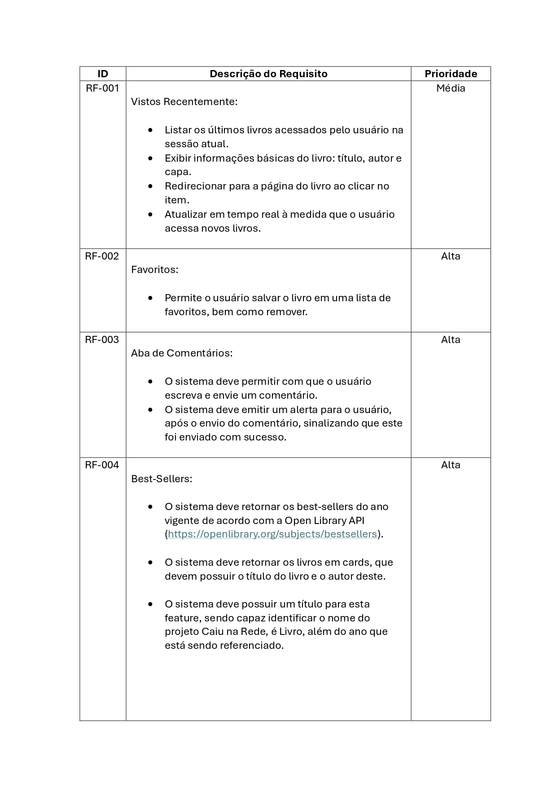

# Product design

Pré-requisitos: <a href="02-Product-discovery.md"> Product discovery</a>

## Histórias de usuários

Com base na análise das personas, foram identificadas as seguintes histórias de usuários:

## Proposta de valor

 
 

 
 

 
 

 
 

 
 

 
 
 
 

## Requisitos

As tabelas a seguir apresentam os requisitos funcionais e não funcionais que detalham o escopo do projeto. Para determinar a prioridade dos requisitos, aplique uma técnica de priorização e detalhe como essa técnica foi aplicada.

### Requisitos funcionais

### Requisitos não funcionais

## Restrições

O projeto está restrito aos itens apresentados na tabela a seguir.

