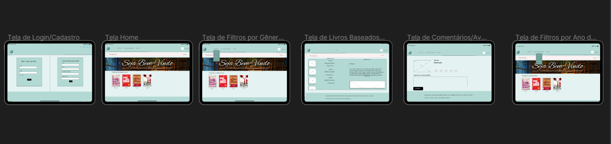
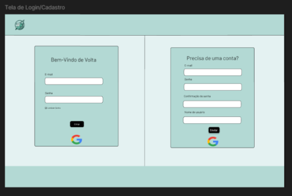
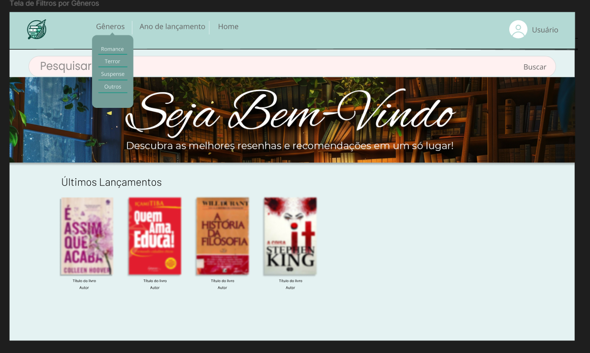
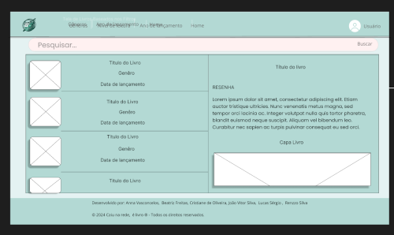
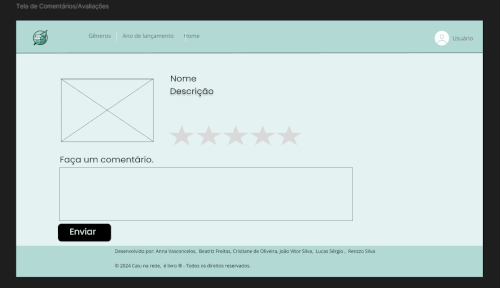
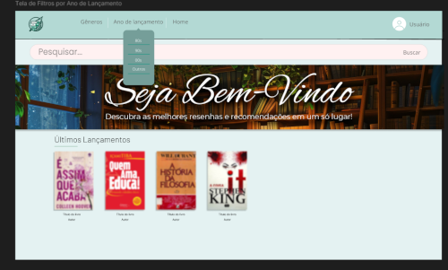

# Projeto de Interface

Pré-requisitos: <a href="03-Product-design.md"> product design</a>

Visão geral da interação do usuário pelas telas do sistema e protótipo interativo das telas com as funcionalidades que fazem parte do sistema (wireframes).

Apresente as principais interfaces da plataforma. Discuta como ela foi elaborada de forma a atender os requisitos funcionais, não funcionais e histórias de usuário abordados na parte de <a href="03-Product-design.md"> product design</a>.

---

## User Flow

Tela de login/cadastro:  tela que possibilita o cadastramento e login de usuários. 

Tela home: tela Principal do site que conta com barra de pesquisa. 

Tela de filtros por gênero:  tela que possibilita a pesquisa de livros através de um filtro de gêneros.  

Tela de livros: tela que exibe o resultado da pesquisa, contando com algumas informações do livro. 

Tela de comentarios: tela que exibe as avaliações e comentários do usuário acerca do livro selecionado. 

Tela de filtros por ano de lançamento: tela que possibilita a pesquisa de livros através de um filtro de ano de lançamento. 

---

## Wireframes

 
 
 

 
 
 

 
 
 

 
 
 

 
 
 

---

## Protótipo Interativo

https://www.figma.com/design/A5oMfq14ZuLkrAkCgpLtBv/Caiu-na-rede%2C-%C3%A9-livro!?node-id=97-280&node-type=canvas&t=ewguO3tT2k66SFXC-0
